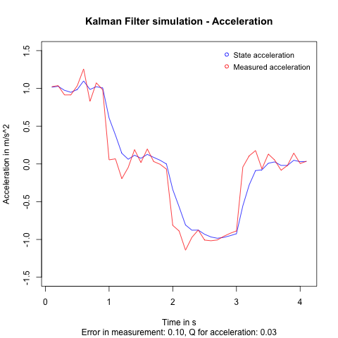

# About 1D acceleration filter

A simplified version of the [2d Filter](../2d_filter/About2DFilter.md).

## Goal

Only one dimension in which the object can move.
The state `x` will contain a distance `d`, a velocity `v` and an acceleration `a`.
The transition functions are as follows:

```
x_k = x_k-1  +  Δt * v_k-1  +  0.5 * Δt^2 * a_k-1
v_k = Δt * a_k-1
```

## Running the simulation

First you need to build the c code.
For this run `cmake -S . -B target/` in the `c_code` directory.
(This step is only necessary once)
Afterwards go into the `target` directory and run `make`.
Now you have an executable named `1dKalmanFilter`.

Run `./1dKalmanFilter > ../../plotting/c_out.txt`.

## Lessons learned

The core problem I wanted to solve were strange position results I got from the [2d Filter](../2d_filter/About2DFilter.md).
On my way to find the source of the problem I wrote some logging and even calculated some steps by hand.
A related problem was the strange behavior of the acceleration which did not follow the measured acceleration fast enough.

After some trying of different initial values for the uncertainty `P`, I noticed that the value for the uncertainty of the acceleration was set to the measurement uncertainty after the first iteration. From there it only got smaller and never larger. Thus the filter trusted it's prediction to much and did not follow the measurement closely. Which lead to the following plot:


The fact that the uncertainty did not increase in the prediction step seemed to be specific to the acceleration. This is probably due to the structure of the `A` matrix, which does has a 1 in the place of the acceleration.

The solution comes in the form of the process noise matrix `Q`.
I previously ignored `Q`, thinking it would add unnecessary complexity.
The updating of the uncertainty then becomes:
```
P = A * P * ~A + Q
```
Since `Q` is added to the uncertainty each prediction step, it leads to a higher `K` and thus to a higher reliance on the measurement.
This leads to the following plot:


Here the `Q` value for the acceleration is `0.05`, so half as much as the measurement uncertainty `R` of `0.1`.
At the points where only the red circles are visible the overlap is so good, that only it gets rendered.

In the cases where the measurement are not ideal, a certain level of smoothing is required. 
For the following plot, the `Q` value for acceleration was lowered to `0.03`.



In conclusion:
- `Q` should not be ignored
- More `Q` means faster convergence and less smoothing