# About the simple matrix filter

## Goal

After the scalar filter and the matrix filter with one degree of freedom I want to implement a slightly more complex example.

The Object of interest is constraint in the z direction, so translation is only possible in x and y.
The Object can also rotate only around z by an angle `φ`.


The measurements of the object's state are the acceleration `a` and the rotation speed `ω`. 

## Tools

The [BasicLinearAlgebra library](https://github.com/tomstewart89/BasicLinearAlgebra) has served me well for the [simple matrix test](../simple_matrix_filter/AboutSimpleMatrixFilter.md), so I will continue using it.

## Theory 

To keep the complexity reasonable I ignored everything to do with control variable `u`.
This means, only the state conversion matrix `A` and the measurement conversion matrix `H` are important.
The resulting block diagram looks like this:


The most notable new thing is the effect of the rotation on the position.
To arrive at a solution I went a bit into trigonometry and complex numbers. 
The resulting formula looks like this:

```
v_x = v_x * cos(φ) - v_y * sin(φ)
v_y = v_x * sin(φ) + v_y * cos(φ)
```

This is analogous for the acceleration.
What is notable is that the rotation can't be applied to the position directly because this would turn the existing global position. Instead the velocity and acceleration must be rotated and then added (after integrating) to the position.

Since the state has to include position, velocity and acceleration in x and y, as well as the rotation and rotation speed, the resulting vector has 8 rows.
The resulting `A` matrix is a 8x8 matrix, which looks like this:


Notable is that when calculating the `A` matrix it needs the current `Δt` and the last `φ`.

## Implementation

To see an improvement between the filter and no filter I need an ideal path on which the object travels.
For this path I decided on this:


Each square in equivalent to one second in time. 
So is accelerates 1s, cruises 3s, decelerates 1s, turns 90 degrees left, accelerates , cruise and decelerates for 1s each. 
Without any measurement errors the object should follow the path perfectly.
With measurement error it should start to drift from the ideal path, because the integration add a lot of uncertainty.

## Running the simulation

First you need to build the c code.
For this run `cmake -S . -B target/` in the `c_code` directory.
(This step is only necessary once)
Afterwards go into the `target` directory and run `make`.
Now you have an executable named `2dKalmanFilter`.

Run `./2dKalmanFilter > ../../plotting/c_out.txt`.

## Lessons learned

1. Having some sort of logging is very useful
2. `Q` should not be omitted
3. Sin and cos were at the wrong point in the filter
4. A higher sample rate makes the filter better
5. Integrating the acceleration twice gives an imperfect result

### Logging

When I was done implementing the filter I had to test it, to make sure it worked correctly.
Initially I only looked at the sta!te in each iteration, because printing everything seemed a hassle and would make the actual code unreadable with all the print statements.
But when I encountered some strange value in the state output, I had no idea where it came from.

So I went back and implemented a logger.
This way I was able to output everything without clutter all over my code.
The logger also has levels to change between a DEBUG mode, where everything will be printed to the console in human readable form and LOG mode where a subset will be printed in a CSV format.

### `Q` is important

As learned in [the 1d filter](../1d_acc_filter/About1dAcc.md), the `Q` matrix should not be omitted, in order to have a fast response to changes in the measurements.

### Rotation transformation must be applied at the correct place

After fixing the slow following of the measurements with `Q` I plotted the results.

Rotation speed and rotation look as expected:

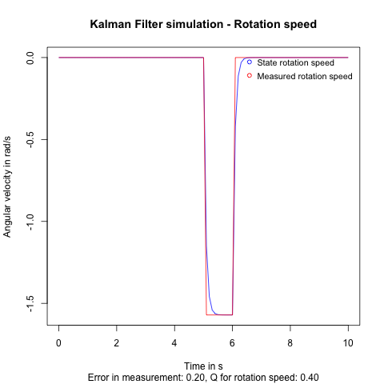
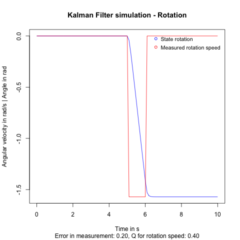

But the acceleration seemed a bit of and the velocity oscillated, which also influenced the position.

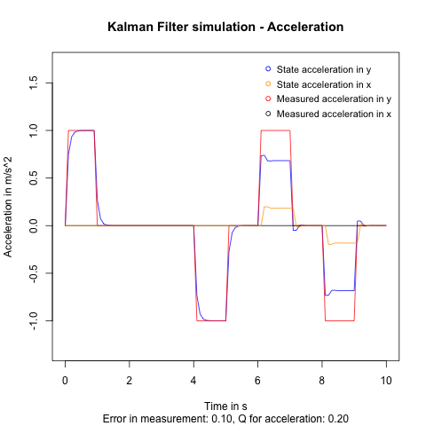
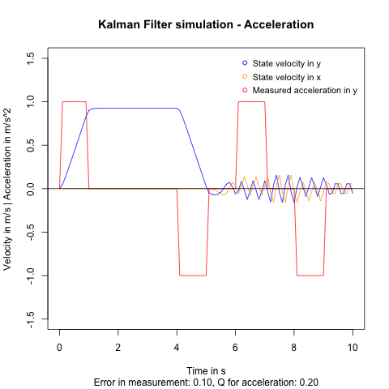
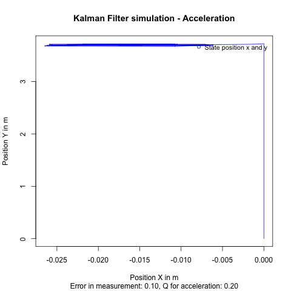

Since everything up the moment of rotation looks fine, my guess was, that I had gotten sin and cos wrong, somewhere in the `A` matrix.

After a lot of DEBUG prints and hand calculations I realized, that the filter currently turns the state by 90 degrees in each prediction step. This is because the `A` matrix does what it is supposed to and transform the local state values into global state values, which in this case is a rotation by 90 degrees.

But this should not happen each prediction step, because it spins the state in circles rather the measurements from the local frame have to be transformed into the global frame.

So I had to change the `A` to not include sin and cos. 
The resulting `A` matrix can be seen as a Kalman filter in the global frame and not caring about rotation other that keeping track of it.

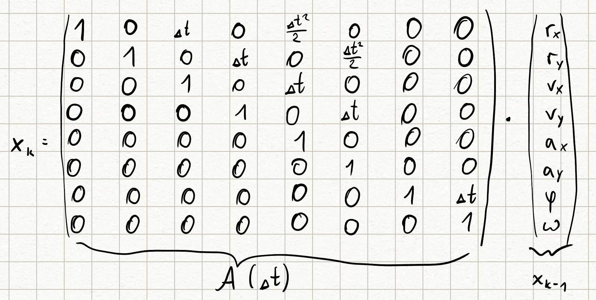

For moving the rotation transformation to the measurement I defined a new matrix `C` and a new vector `y`.
`y` is the raw sensor output and `C` is the transformation matrix from the local frame to the global frame. 

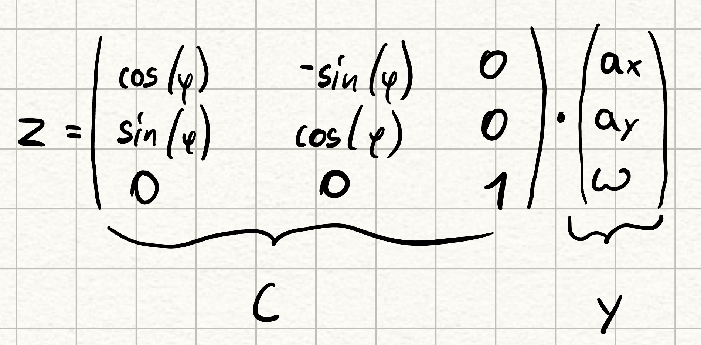

Lastly I redrew the overview of the filter to reflect all the changes that happened along the way.

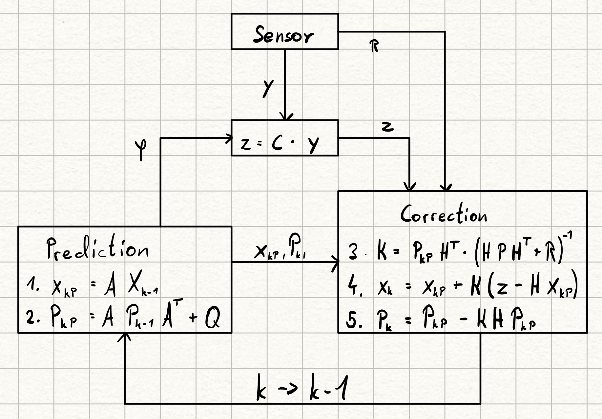

Here some plots from this improved filter:

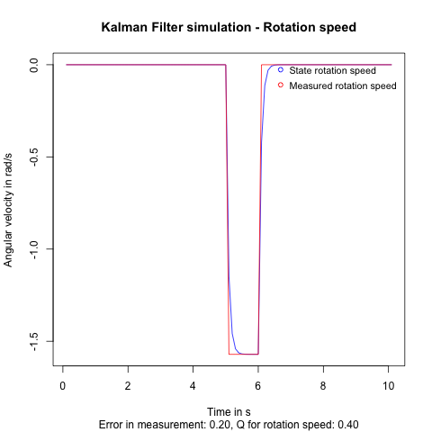
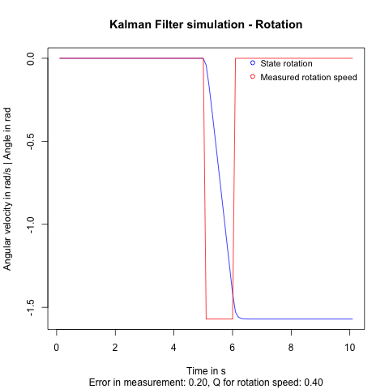

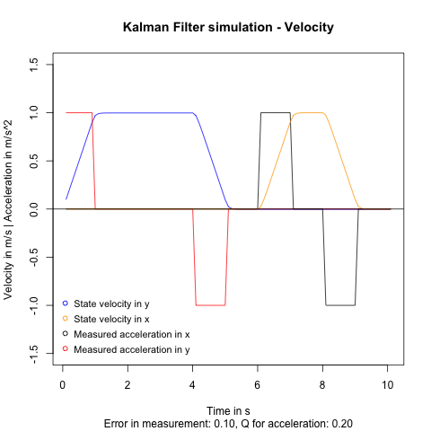
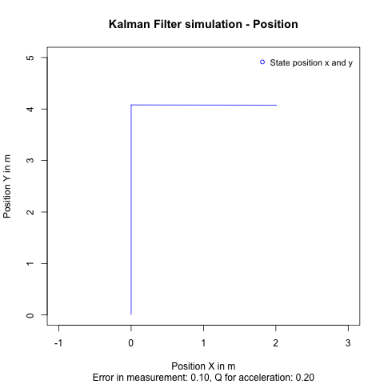

### Higher sample rate is still imperfect

After this I wanted to see how the filter would fare with some simulated noise in the measurements.
To even get a smoothing effect I had to drop the values for `Q` to a tenth of the standard deviation of the noise. 

It seems that the ration between `Q` and `R` is important. 
When I messed around with taking the square of the standard deviation (to get the variance) and use this as values for `R` I was faced with no smoothing at all. 
My assumption from this is that the values for `Q` should always be smaller that the values of `R`.

I also tried to increase the sample rate of the measurements. 
This had a noticeable effect on the error between perfect and estimated measurements.

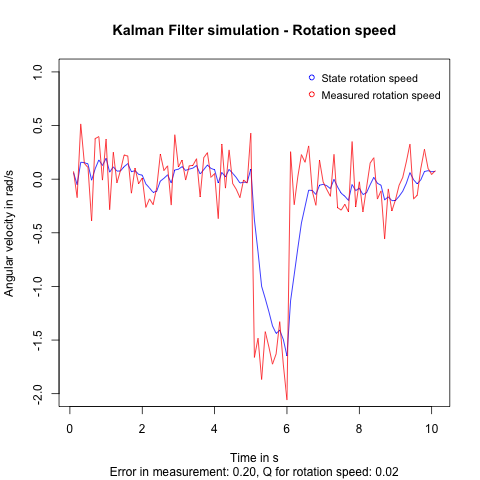
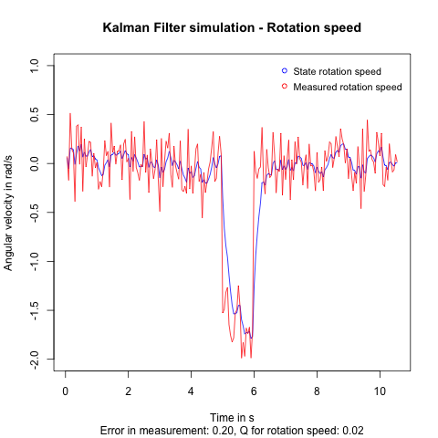
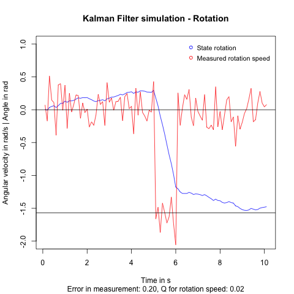
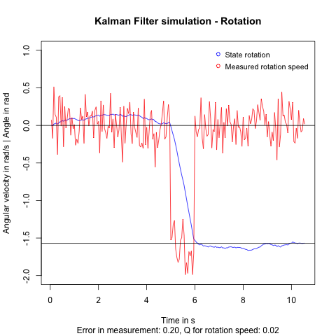

But still the double integration of the acceleration leads to an imperfect position estimate.
An even higher sample rate might be helpful there.

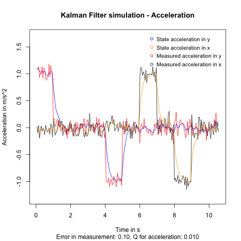
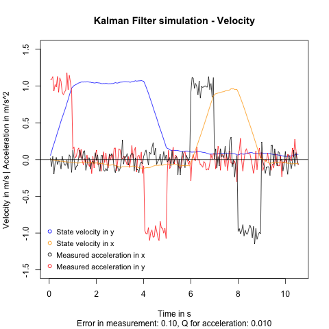
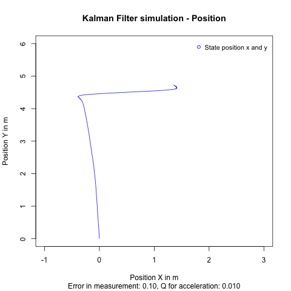
