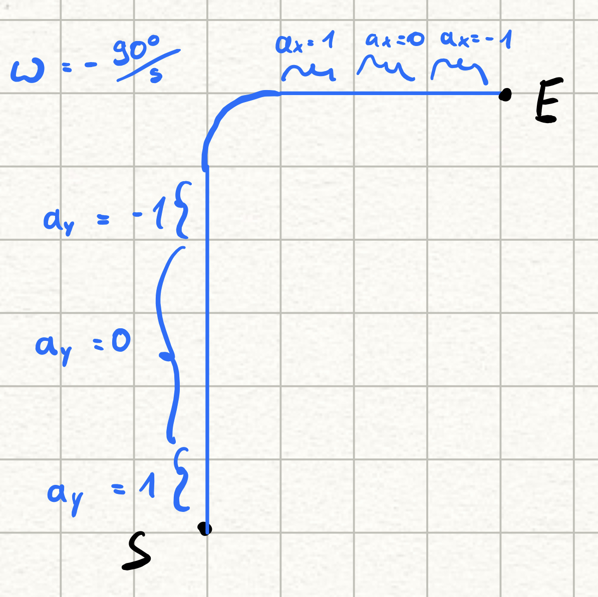

# About the simple matrix filter

## Goal

After the scalar filter and the matrix filter with one degree of freedom I want to implement a slightly more complex example.

The Object of interest is constraint in the z direction, so translation is only possible in x and y.
The Object can also rotate only around z by an angle `φ`.


The measurements of the object's state are the acceleration `a` and the rotation speed `ω`. 

## Tools

The [BasicLinearAlgebra library](https://github.com/tomstewart89/BasicLinearAlgebra) has served me well for the [simple matrix test](../simple_matrix_filter/AboutSimpleMatrixFilter.md), so I will continue using it.

## Theory 

To keep the complexity reasonable I ignored everything to do with control variable `u`.
This means, only the state conversion matrix `A` and the measurement conversion matrix `H` are important.
The resulting block diagram looks like this:


The most notable new thing is the effect of the rotation on the position.
To arrive at a solution I went a bit into trigonometry and complex numbers. 
The resulting formula looks like this:

```
v_x = v_x * cos(φ) - v_y * sin(φ)
v_y = v_x * sin(φ) + v_y * cos(φ)
```

This is analogous for the acceleration.
What is notable is that the rotation can't be applied to the position directly because this would turn the existing global position. Instead the velocity and acceleration must be rotated and then added (after integrating) to the position.

Since the state has to include position, velocity and acceleration in x and y, as well as the rotation and rotation speed, the resulting vector has 8 rows.
The resulting `A` matrix is a 8x8 matrix, which looks like this:


Notable is that when calculating the `A` matrix it needs the current `Δt` and the last `φ`.

## Implementation

To see an improvement between the filter and no filter I need an ideal path on which the object travels.
For this path I decided on this:



Each square in equivalent to one second in time. 
So is accelerates 1s, cruises 3s, decelerates 1s, turns 90 degrees left, accelerates , cruise and decelerates for 1s each. 
Without any measurement errors the object should follow the path perfectly.
With measurement error it should start to drift from the ideal path, because the integration add a lot of uncertainty.

## Running the simulation

First you need to build the c code.
For this run `cmake -S . -B target/` in the `c_code` directory.
(This step is only necessary once)
Afterwards go into the `target` directory and run `make`.
Now you have an executable named `2dKalmanFilter`.

Run `./2dKalmanFilter > ../../plotting/c_out.txt`.

## Lessons learned

The two measurements are simulated in a ways which is plotted here:


