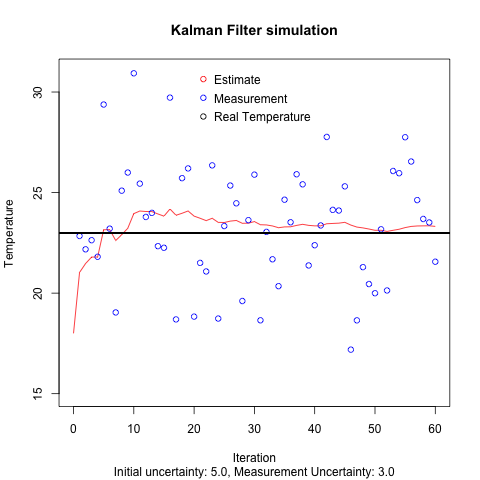

# About the scalar filter

## Inspiration

On my journey to finding good learning resources about kalman filters I stumbled upon this [series of YouTube videos](https://www.youtube.com/watch?v=CaCcOwJPytQ&list=PLX2gX-ftPVXU3oUFNATxGXY90AULiqnWT&index=2).
In it the first examples (episodes 5 and 6) are of a temperature reading with some uncertainty in the measurement. 
With this example I finally understood the basic principles of the kalman filter

## Goal

To really understand these basic principles I want to implement a simulation of the temperature measurements and play around with some filter parameters.
During this process I will write my learned lessons in this document to reference later or show someone who might want to learn about this themself. 

## Tools

Because I want to learn rust, this first implementation will be written in it.
To visualize the behavior I will use R to plot it.

## Theory 

First some notation has to established.
The following notation is an amalgamation of the aforementioned YouTube videos and one of my University courses.
Note that K, P and R are uppercase, because they will later be matrices. For now everything is a scalar value.

- x: State
- z: Measurement 
- K: Kalman Gain
- P: Process uncertainty
- R: Measurement uncertainty
- k: running sample number (written as subscript with P_k or P_k-1 for previous sample)

The basic idea is to estimate the state of a system with measurements of it and the uncertainty of these measurements. 
What is missing from this very simple temperature example is something like the control input `u` which would necessitate a prediction and a correction step. Here only correction is needed.

There is a formula associated with each of the three steps.

1. `K = P / (P + R)`
2. `x_k = x_k-1 + K * (z - x_k-1)`
3. `P_k = (1 - K) * P_k-1`

## Running the simulation

1. Change `x`, `p`, `r` (and maybe `iterations`) in `scalar_filter_rust/src/main.rs` as you want
2. Run `cargo run > ../plotting/rust_out.txt` in the directory `scalar_filter_rust` from the terminal
3. Run the R script `plotting/scalarKalman.r` to get a resulting png

## Lessons learned

There are 3 initial parameters which impact the behavior of the estimate:
- `x` the initial estimate of the true value
- `p` the uncertainty of the estimate
- `r` the uncertainty of the measurement

`x` does not have much impact on the behavior. If it is set to exactly the true value it might deviate for a few steps. If it is set far away, it quickly converges on the true value. How quickly is determined by `p` and `r`.

`p` impacts the reliance on the initial guess. 
A low `p` means a slow change from the initial guess because it does not follow the measurement heavily. This is good if the initial guess is close to the real value.
A high `p` means a faster change, which often leads to overshoots. 
In general a higher `p` is preferable. From testing with the simulation, it seems that a `p` at least as high as the `r` converges quickly

`r` has the most impact, since it is what needs to be compensated. A high `r` takes more steps to converge and is less stable in general. Since `r` can not be chosen, but only measured, this is mostly to say, that less noisy sensors are better.

Here is an example of a plot:

