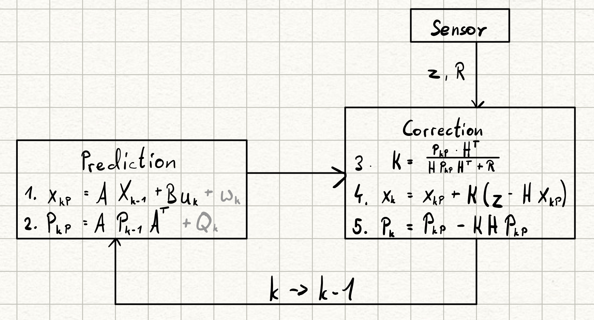
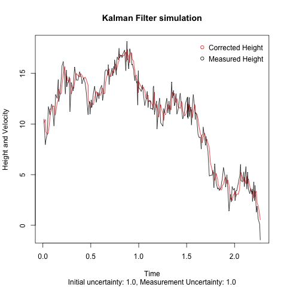
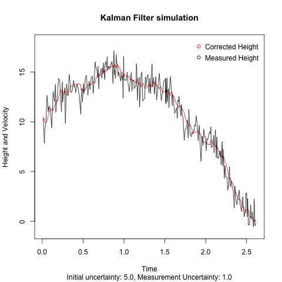

# About the simple matrix filter

## Goal

After gaining an understanding of the basic concepts of the kalman filter with the scalar examples I want to implement a very simple matrix version of it.
The example I want to use is an object falling in one dimension, which I will call `h` for height.
The state of the object will consist of `h` and `v` the velocity with which it is falling.
Because the state is a vector now, every other value like the Kalman Gain `K` must be a matrix now.

## Tools

As a guide I will continue to refer to the [YouTube series](https://www.youtube.com/watch?v=CaCcOwJPytQ&list=PLX2gX-ftPVXU3oUFNATxGXY90AULiqnWT&index=2) mentioned in the [scalar filter example](../scalar_filter/AboutScalarFilter.md).

Since this code will eventually run in c++ on an Arduino I am using c++ for this example with the [BasicLinearAlgebra library](https://github.com/tomstewart89/BasicLinearAlgebra).

## Theory 

The basic idea for the filter is the same as in the scalar example. What is new is the prediction step, which is necessary because of the external influence of gravity. If the example was chosen such that `u` was zero, the whole step would be unnecessary. 

Notation:
- x: State (vector of `h` and `v`)
- A: State conversion matrix (converts old state into new state, according to equations of motion)
- u: Control variable or known external influences (acceleration `a`)
- B: Control conversion matrix (converts control state to be added to state)
- w: Noise in the process (excluded here)
- P: Process uncertainty
- Q: Process noise covariance matrix (excluded here)
- z: Measurement (`h` only)
- R: Measurement uncertainty
- K: Kalman Gain 
- H: Measurement conversion matrix (converts state to be subtractable from measurement)
- sub k: running sample number (written as subscript with P_k or P_k-1 for previous sample)
- sub P: Predicted value, no P means it was corrected with the measurement

## Implementation

## Running the simulation

First you need to build the c code.
For this run `cmake -S . -B target/` in the `c_code` directory.
(This step is only necessary once)
Afterwards go into the `target` directory and run `make`.
Now you have the executable named `SimpleMatrixFilter`.

To execute the c code run `./SimpleMatrixFilter > ../../plotting/c_out.txt` inside of the `target` directory, to generate the output.
Now the output is in `c_out.txt` from where the `matrixKalman.r` script can use it to draw a plot.

## Lessons learned

The most important thing I saw was that the expected measurement uncertainty should be higher that the actual measurement error. At least in this example.

A higher uncertainty means a smoother graph, but also a slower reaction. This is probably something that needs to be tested with real sensors.